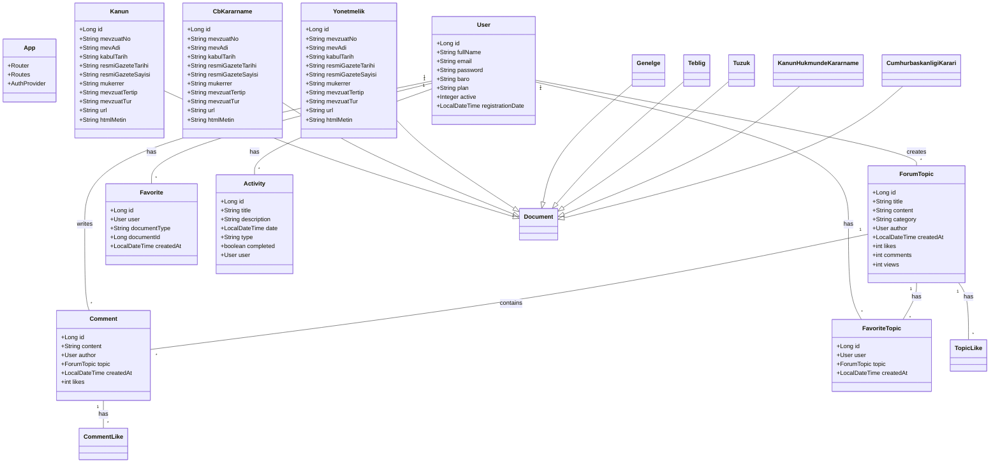

# AiVUKAT Sınıf Diyagramı

## Açıklama

Bu sınıf diyagramı AiVUKAT uygulamasının temel yapısal bileşenlerini ve aralarındaki ilişkileri göstermektedir:

1. **Temel Varlıklar**:
   - `User`: Sistemin kullanıcılarını temsil eden ana varlık
   - `App`: Yönlendirme ve kimlik doğrulama işlemlerini yöneten ana uygulama bileşeni

2. **Belge Türleri**:
   - Temel `Document` sınıfından türeyen çeşitli yasal belge türleri (`Kanun`, `CbKararname`, `Yonetmelik` vb.)
   - Her belge türü `mevzuatNo`, `mevAdi`, `kabulTarih` gibi ortak özelliklere sahiptir

3. **Forum Sistemi**:
   - `ForumTopic`: Tartışma konularını temsil eder
   - `Comment`: Konulara yapılan yorumları temsil eder
   - `TopicLike` ve `CommentLike`: Konu ve yorumlar için beğeni işlemlerini yönetir

4. **Favoriler Sistemi**:
   - `Favorite`: Yasal belgeleri kaydetmek için
   - `FavoriteTopic`: Forum konularını kaydetmek için

5. **Aktivite Sistemi**:
   - `Activity`: Sistemdeki kullanıcı aktivitelerini takip eder

6. **İlişkiler**:
   - User ile oluşturduğu içerikler arasında bire-çok ilişkiler
   - ForumTopic ile yorumları arasında bire-çok ilişkiler
   - Favoriler ve beğeniler için çoka-çok ilişkiler 
